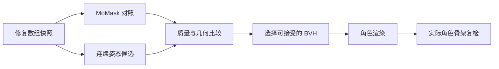

# MotionLint：减少动作转换与角色渲染的质量损失

本文保留规则版本 2 下的转换实验。后续脚部约束、时间轴、四组实验及当前版本 3 结果见 [最新实现与交接](MOTIONLINT_DELIVERY_20261002.md)，不同规则版本分数不能直接比较。

_2026-10-02 · 接续修复角色导出验证；使用两个已有开发样例。_

## 📋 结果

已将连续旋转拟合接入现有 InterGen 修复导出入口。它按输入动作估计每个人的骨长和分支形状，并尽量保持相邻帧的局部旋转连续。导出时仍生成 MoMask 结果作为对照，自动检查候选再选择输出。

两条动作已经重新生成完整 Kenney 双人视频，并读取实际 Blender 角色骨架复检。角色总分分别提高 **5.77** 和 **5.66** 分。两条最终角色的严格质量门仍为 **FAIL**，失败原因都是脚滑；地面接触和动作 jerk 仍为 WARN。配置和质量门阈值保持原样。

| 样例 | 修复数组 | 原 BVH → 新 BVH | 原角色 → 新角色 | 新角色质量门 |
| --- | ---: | ---: | ---: | --- |
| 双人舞蹈 `91d1b363` | 97.59 / PASS | 86.68 → 92.43 | 83.61 → 89.38 | FAIL：脚滑 |
| 握手 `9323c3fd` | 94.03 / FAIL | 90.05 → 94.12 | 84.55 → 90.21 | FAIL：脚滑 |

每条均为 180 帧、30 FPS、6 秒、540×540。同一条样例的新旧输入 SHA-256、质量配置 SHA-256、角色资产路径、动作配置、间距、渲染尺寸、重定向平滑及约束设置一致。本轮只改变 BVH 转换方法，未重写保存的修复数组。

这两条属于开发样例。此前独立验证集的 0/10 PASS 记录未被改写，本轮不提供新的泛化通过率。

## 🔍 原因与改动

原 MoMask 导出使用固定骨架模板。模板与这些输入的骨长存在约 5%–16% 的偏差；逐帧 IK 还在肩膀、脊柱等部位产生了不必要的旋转跳变。根节点原导出的坐标误差小于 1 微米，未发现根位移单位错误。

| 诊断量 | 双人舞蹈：原 → 新 | 握手：原 → 新 |
| --- | ---: | ---: |
| 平均关节位置误差，相对修复数组 | 20.72 mm → 3.96 mm | 24.33 mm → 3.09 mm |
| 最大相邻帧局部旋转变化 | 130.87° → 42.82° | 81.08° → 18.05° |
| BVH 旋转连续性分数 | 80.96 → 100 | 84.09 → 100 |

新实现 `motionlint/joints_to_bvh.py` 使用 NumPy 和已有 BVH 写入器：

- 每条骨使用输入序列长度的中位数；髋、肩等多个子节点分支通过刚体拟合估计平均形状。
- 多子节点用方向拟合旋转；单子节点沿上一帧的局部姿态选择最小变化旋转。
- BVH 写出后用已有 PyMotion 读取器独立 FK，要求坐标往返误差不超过 0.1 mm。
- 拟合可能改变最低脚部高度，根节点仅沿 Y 轴最多调整 1 cm，以尽量保留输入脚部高度；X/Z 保持原输入。两条样例实际最大调整分别为 9.09 mm 和 6.97 mm。
- 记录骨架偏移、源文件、拟合误差、根高度修正、往返误差及方法限制。

关节位置无法唯一确定骨骼轴向扭转和末端朝向。此方法给出连续的可行姿态，不能恢复未观测到的真实扭转。骨长本身变化的输入也只能用固定骨长近似。

最初未保留源脚部高度的候选导致舞蹈地面接触分数下降超过 5 分，已拒绝。最终方法加入有界的高度保留后，在相同阈值下通过回归比较。

## ⚙️ 自动选择与证据



选择候选要求：总分不下降、通过现有回归门、没有新增 FAIL 检测项、每个人的位置误差均值/P95/最大值不增大超过数值容差、根位置误差不超过 1 cm。容差为 0.01 mm；原回归门允许单项最多下降 5 分。候选转换异常时保留可用的 MoMask 结果。

这项选择只针对 BVH，不能保证后续角色通过。最终角色继续独立检查，并保留真实 FAIL。本轮两个角色回归比较均 PASS；其中舞蹈脚滑分数从 **73.93 降到 72.04**，下降 1.89 分，在现有容许范围内。不能将总分提高解释为所有检测项都提高。

| 角色检测项 | 舞蹈：原 → 新 | 握手：原 → 新 |
| --- | ---: | ---: |
| 旋转连续性 | 82.98 → 100 / PASS | 85.12 → 100 / PASS |
| 骨架完整性 | 100 → 100 / PASS | 100 → 100 / PASS |
| 脚滑 | 73.93 → 72.04 / FAIL | 74.41 → 76.78 / FAIL |
| 地面接触 | 71.87 → 87.17 / WARN | 70.73 → 79.87 / WARN |
| 骨架距离碰撞检查 | 100 → 100 / PASS | 100 → 100 / PASS |
| 动作 jerk | 64.48 → 68.98 / WARN | 70.35 → 78.73 / WARN |

碰撞检查使用骨架距离，未进行蒙皮网格碰撞检测，角色穿模仍需观看画面确认。

每次导出目录新增 `conversion_candidates/momask/`、`conversion_candidates/continuous/` 和 `converter_selection.json`。原结果、候选结果及其检测报告保留；固定的 `repaired_actor*.bvh` 是实际进入角色渲染的版本。ZIP 包含这些动作和报告，继续排除 FBX、Blender 场景和模型权重。

本轮机器证据保存在 `reports/continuous_export_20261002/`：

- `dance_baseline.json`、`handshake_baseline.json`：原导出指针快照。
- `dance_comparison.json`、`handshake_comparison.json`：相同输入/配置/渲染设置下，对实际 BVH 和角色重新检测后的对照。
- `verification.json`：输入哈希、完整视频解码、ZIP 完整性和独立阶段分数验证。

新导出目录：

| 样例 | 任务目录下的导出路径 |
| --- | --- |
| 舞蹈 | `motionlint/exports/e626df4ad3ad496ca13e6a5d27cde176/` |
| 握手 | `motionlint/exports/76940691798e40cf915c8589a42d93cd/` |

## ✅ 使用与验证

现有网页“导出修复角色”和终端 `python -m motionlint.export_intergen --task ...` 自动使用上述比较流程。无需新增模型、训练检查点或 Python 依赖。再次检查时网页也会更新导出摘要，能够读取终端产生的新结果。

本轮验证：

- 24 项转换、异常回退、导出、阶段和 API 测试通过；包含非统一骨长、平滑转身与关节弯曲的独立 FK 输入，验证 BVH 几何往返及旋转连续性。
- 前端生产构建、现有角色选择回归脚本通过。
- 两条新视频完整 FFmpeg 解码通过，两个下载包完整性通过，落盘与独立复检分数/质量门一致。
- 浏览器加载舞蹈任务后显示 92.4 / FAIL 和 89.4 / FAIL；角色视频 `duration=6`、`readyState=4`，播放到 `currentTime=6`、`ended=true`。
- 页面截图 `output/playwright/continuous-export-20261002.png`，视频原尺寸帧 `output/playwright/continuous-dance-frame.png`；浏览器仅有既存 favicon 404。

独立对照入口：

```powershell
& '..\HumanAction-runtime\envs\motionlint\Scripts\python.exe' `
  scripts\compare_repaired_exports.py `
  --baseline reports\continuous_export_20261002\dance_baseline.json `
  --candidate InterGen_api\task_runs\91d1b363-c453-4526-8bb2-8f933f25809b\motionlint\character_export.json `
  --output reports\continuous_export_20261002\dance_comparison.json
```

`scripts/compare_bvh_converters.py` 重新运行时会读取保留的 MoMask 对照，避免与已选中的连续转换结果自身比较。

## 📍 下一项任务

优先处理**实际角色阶段的脚滑**：复核接触识别、角色脚部约束和脚锁定的转换损失；同时保护已改善的连续性、骨架几何与地面接触，使用相同阈值复检。问题时间轴、设置页、四组系统实验及最终材料仍需按原方案完成。
