# MotionLint Studio：实现、实验与交接

历史规则 v3 记录。当前方案的实施状态、真实新样本和许可边界以 [v4 实施状态](MOTIONLINT_IMPLEMENTATION_STATUS.md) 为准。本文件内的旧改善量仅适用于原规则，15 条动作均属于开发资料。

2026-10-02 · 本地可演示版本 · 以现有 HumanAction-Platform 为基础

## 1. 项目定位与完成范围

现有 InterGen 文本双人动作、LODGE 音乐舞蹈和角色渲染保留为生成后端。新增 MotionLint 层统一读取动作、检查六项指标、定位问题帧、尝试有限修复、全量复测、拒绝退步候选，并导出动作、视频和机器报告。没有重训或替换生成模型。

当前已经达到“能运行、能演示、能检查、能修复部分问题”的原型状态。严格质量全部达标仍未完成，正式提交和公开发布也未执行。

| 任务 | 已完成 | 仍存在的限制 |
| --- | --- | --- |
| 最终角色脚滑 | 趾端接触驱动的有界 IK、保留脚部世界朝向、实际角色 FK 复检、自动接入导出 | 两条角色仍有残余脚滑 |
| 六项质检 | 连续性、骨架、脚滑、地面、碰撞、jerk；碰撞增加双方手部对躯干检查 | 地面及 jerk 仍有 WARN，碰撞为骨架近似 |
| Web 工作台 | Generate/Inspect/Repair/Regression/Settings；区间时间轴、筛选、帧定位、修复问题段与影响帧计数、播放偏好及规则查看 | 五个入口共用现有页面；规则在设置中只读 |
| 系统实验 | 15 条去重动作、30 次独立修复试验、接缝/脚滑/碰撞/回归四组记录 | 复用已有验证样本，不是新的盲测；真实音乐泛化未验证 |
| 比赛审阅材料 | 本文、可重建视频、CSV/JSON、许可证文件、复现操作说明 | 成员分工、素材人工审核、讲解与提交由用户完成 |

## 2. 流程与第三方复用

```mermaid
flowchart LR
    accTitle: MotionLint 检查和修复流程
    accDescr: 生成器输出标准动作，经过六项检查和有限修复后复测，导出 BVH 和角色并再次检查实际播放阶段。
    generator[InterGen / LODGE] --> normalize[统一动作适配]
    normalize --> inspect[六项检测与问题区间]
    inspect --> candidate[有限修复候选]
    candidate --> regression[全量复测与回归门]
    regression --> selection[接受候选或保留原结果]
    selection --> export[BVH 与角色导出]
    export --> final[实际角色骨架复检]
    final --> artifacts[视频 / ZIP / 报告]
```



InterGen、LODGE、MoMask、PyMotion、Blender 与 Rokoko 的能力分别用于生成、格式处理和角色重定向；MotionLint 检查、受限修复、回归比较及 UI 是本地新增模块。第三方来源和许可见仓库根目录的 `THIRD_PARTY_NOTICES.md`、`MODEL_LICENSES.md`、`ASSET_LICENSES.md`。不得把生成器或第三方角色声明为团队原创。

连续 BVH 转换拟合骨长及分支几何，并保留局部旋转连续性。它与 MoMask 在同一修复输入和规则下比较，只有总分、回归和几何误差均符合条件才被选择。实际角色还要单独检测，数组 PASS 不代表角色 PASS。

## 3. 最终角色脚滑：同规则前后比较

本表使用新规则版本 3；前后均从实际 Blender 角色骨架读取。每条 180 帧、30 FPS、6 秒，540×540。输入修复数组未改写。接触条件保持低高度、低垂直速度和最小接触时长，不用水平滑动速度排除接触帧。

| 样例 | 角色总分：脚修复前 → 后 | 脚滑分数：前 → 后 | 原接触区间超速次数：前 → 后 | 最终严格质量门 |
| --- | ---: | ---: | ---: | --- |
| 双人舞蹈 | 86.95 → 89.83 | 72.04 → 86.54 | 148 → 0 | FAIL |
| 握手 | 90.21 → 91.44 | 76.78 → 83.03 | 80 → 11 | FAIL |

“原接触区间超速次数”是在固定的原始接触掩码下，对每个角色、每个脚关节、每个相邻帧统计，不能当成唯一问题帧数或整体通过率。重新估计接触后仍可能出现新接触区间问题，因此舞蹈即使原区间超速为零，完整脚滑检查仍 FAIL。

角色修复限于脚部水平位移，最大计划修正 15 cm，腿链两段 IK 不拉伸，保留观察到的脚部世界朝向；融合边界并保留根轨迹。先烘焙现有约束的实际姿态，要求烘焙前后规范关节误差不超过 0.1 mm。候选需脚滑改善、原接触超速减少、总分不下降、无新增 FAIL、回归门 PASS、实际位移不超过数值容差，才渲染和发布。

两条角色的连续性与骨架均为 100；地面分数不变；jerk 分数分别小幅下降 0.18 与 0.16。舞蹈还存在手部与另一人躯干间的距离风险。所有这些结果按实测保留，未把失败伪装成通过。

- 双人舞蹈任务 `91d1b363-c453-4526-8bb2-8f933f25809b`：最终导出 `feet-04a455cadc094b2d9a2b5cd2f88b2ac5`，实际关节最大位移 137.71 mm。
- 握手任务 `9323c3fd-d1a9-4a94-877d-c47bbca5dd4b`：最终导出 `feet-e1a5ea4fbccc430ea955257c6de8e6bb`，实际关节最大位移 150.00 mm。

完整证据：`reports/character_feet_20261002/integrated_verification.json`。它验证保存输入哈希、独立阶段分数/质量门、ZIP 完整性和完整视频解码；发布脚修复视频前还要求解码帧数与实际角色帧数一致。

## 4. 规则版本与碰撞指标

新默认版本 3 增加另一侧角色手部检查和双方手到另一人躯干线段的距离检查。权重、数值阈值及严格质量门保持原值。碰撞分数在覆盖范围扩大后可能降低；版本 2 与版本 3 的分数不得直接作为修复前后增量。

每次导出保存 `quality.yaml`；网页 Settings 根据当前阶段展示此次导出的固定规则，设置接口同时提供规则哈希。历史版本 2 导出仍按旧覆盖范围复检。历史转换实验见 `MOTIONLINT_CONVERSION_OPTIMIZATION_20261002.md`，其中数值属于版本 2。

`penetration_estimate_m` 是骨架清距离阈值不足量，单位米，不能解释为蒙皮网格的真实穿透深度。碰撞影响帧去重统计；问题携带双方角色和关节编号。握手等允许接触的语义可能造成距离风险，当前仍需人工看视频判断。

## 5. 四组系统实验

输入通过 SHA-256 去重后为 15 条生成动作：5 条开发样本和 10 条以前已用过的验证样本；其中 11 条 InterGen、4 条 LODGE 合成节拍任务。原始/预处理的同一生成不重复计为独立样本。此前 0/10 验证记录保留；本轮没有新的泛化通过率。

| 实验 | 试验数 | 接受数 | 执行错误 |
| --- | ---: | ---: | ---: |
| 脚滑有限修复 | 15 | 12 | 0 |
| LODGE 接缝修复 | 4 | 0 | 0 |
| 局部碰撞修复 | 11 | 1 | 0 |

### A. LODGE 接缝

四条真实生成动作分别读取连续化前的 `.raw.npy`，与单独的接缝候选比较。四条连续性分数原本均为 100，候选没有严格改善目标分数，因此没有作为改善修复接受。总表保留边界附近角步长变化率和根位移指标，不能据此宣称所有接缝问题都已解决。

边界角加速度指标定义为相邻帧旋转角步长的差值乘 FPS²，在第 256 帧等边界邻域取最大值；它不是完整旋转向量导数。

### B. 脚滑

15 条各尝试固定强度 0.5 的区间锚定修复，不启用整个自动修复搜索。12 条通过接受条件；3 条因其他检测项退步或总分变化被拒绝。原接触掩码超速统计同时约束接受，避免靠把脚抬离接触范围提高分数。

15 条候选的严格质量门均仍 FAIL。接受表示候选相对原结果符合有限改善条件，不表示动作整体合格。

### C. 局部碰撞

11 条 InterGen 各尝试现有手腕局部避碰。仅一条挥手验证样本碰撞分数 82.43 → 82.95、总分 86.11 → 86.20，候选被接受。其他任务无改善或被拒绝。该局部方法不能修复所有双人交互碰撞，不能把无操作候选统计为修复成功。

### D. 回归检测

独立合成阳性对照包含 600 帧和第 256 帧根位移接缝。接缝平滑后故意叠加每帧 0.012 m 的水平滑动：连续性 87.92 → 100，脚滑 86.65 → 56.75，jerk 87.29 → 100。系统识别 `REGRESSION DETECTED`，脚滑下降 29.90 分。该对照验证拒绝机制，不属于真实生成模型比较，也不计入 15 条样本。

实验输出 `reports/system_experiments_20261002/` 包含总表 `summary.csv`、长格式 `metrics.csv`、每条 before/candidate 报告、源码哈希、规则哈希、输入哈希及被拒绝候选记录。跨不同提示词的 `candidate_ranking` 仅为批次排序，不能当成同提示词生成候选选择实验。

InterGen 原有同提示词多样本生成、固定 seed 及物理质量排序入口保留；本轮没有另跑新的多 seed 生成实验。若要证明“最佳候选更符合语义”，还需人工语义评审。

## 6. Web 功能和复现操作

在项目目录运行：

```powershell
.\start-local.ps1
# 浏览器打开 http://127.0.0.1:5173/
$python = '..\HumanAction-runtime\envs\motionlint\Scripts\python.exe'
& $python scripts/run_motionlint_system_experiments.py
& $python scripts/verify_motionlint_export.py `
  91d1b363-c453-4526-8bb2-8f933f25809b `
  9323c3fd-d1a9-4a94-877d-c47bbca5dd4b `
  --output reports/character_feet_20261002/integrated_verification.json
& $python scripts/build_motionlint_review_materials.py
```

端口：InterGen 8001、LODGE 8002、MotionLint 8003、Web 5173。上述实验重建需要本机已有 `task_runs` 和验证清单；这些生成产物及模型不随源码克隆提供。全新机器应按 `LOCAL_SETUP.md` 配置运行时，并先生成动作。已有质检 CLI 可独立于生成模型运行。

网页建议演示：Inspect → 选择舞蹈任务 → 加载并检查 → 播放并检查修复角色 → 时间轴筛选 Foot Sliding → 点击红色问题段 → 检查帧号/速度/阈值 → Settings 查看规则与倍速 → Regression 查看前后变化 → 下载完整包。

时间轴合并相邻同类区间，保留匹配问题数；点击合并段展示其中首个问题。修复计数区分问题段和去重影响帧，不把问题数变化当成全部修复。BVH 没有匹配视频时帧拖动禁用；不会用另一处理阶段的视频冒充。

Settings 提供倍速、循环、定位后播放和本机偏好保存，检测权重/阈值只读，可下载当前规则 JSON。新接口：`GET /v1/motionlint/settings` 和 `GET /v1/motionlint/tasks/{source}/{task_id}/repair-summary`。

浏览器证据位于 `output/playwright/studio-timeline-20261002.png` 与 `studio-settings-20261002.png`。真实浏览器验证选择第 66 帧后停在 2.2 秒、0.5 倍速，详情显示 0.2349 m/s 对阈值 0.16；未出现 JavaScript 页面异常。

## 7. 验证结果

- 72 项 MotionLint 测试通过，包含脚修复约束、悬空脚排除、Blender Python 异常传播、截断视频拒绝、新碰撞范围、冻结规则和修复计数。
- 前端生产构建和角色选择回归脚本通过；时间轴合并、过滤、帧定位及输入不变性检查通过。
- 两条最终角色视频完整解码与 ZIP 完整性通过，独立复检分数和质量门与保存结果一致。
- 实际浏览器完成时间轴定位、0.5 倍速、设置固定版本查看及 6 秒角色完整播放；无 JavaScript 页面异常。

这些检查验证实现和产物一致性，不证明所有动作质量合格。

## 8. 演示与材料范围

新版无旁白演示：`output/video/motionlint_review_20261002.mp4`（3 分钟，约 6.5 MB）。从本次两条实际 Kenney 角色的脚修复前后视频和本地 UI 截图重建，前后标为“角色脚修复前/后”，两侧均已有上游数组修复，不冒称原始模型输出。每条 6 秒片段循环用于观看；不含音乐音轨，也不展示 SMPL-X 模型资源文件。

旧演示和 PDF 草稿保留为历史材料，不是当前规则版本 3 的最终报告。最新审阅包是 `output/review/motionlint_review_20261002.zip`，包含本报告、实验证据、截图及演示；它是本机审阅资料，不是完整部署包，不包含模型、FBX 或 Blender 场景。包内 SHA-256 清单可核对完整性。

开发使用 Codex 辅助实现、测试和文档整理。团队应审核源码、许可和结果解释，再确定正式提交文字。没有执行 Git 提交、远程发布或比赛上传。

## 9. 后续由用户决定或补充

- 观看演示并判断动作语义、角色穿模和残余脚滑是否满足“差不多复现”的目标。
- 若追求严格 PASS：继续处理新接触区间脚滑、地面与 jerk；双人碰撞需区分允许接触和真实风险，建立人工标注。
- 提供有展示许可的真实音乐，再生成新的独立舞蹈样本；当前四条为合成节拍技术验证。
- 明确队伍分工、权利人、拟公开源码范围及许可，审核第三方素材和 AI 辅助披露。
- 补充讲解/录音，并依据实际赛事要求核对文档、视频、报名字段，再由用户提交。

这些事项不阻止当前本地演示，但不能将本地原型等同于完成正式提交。
