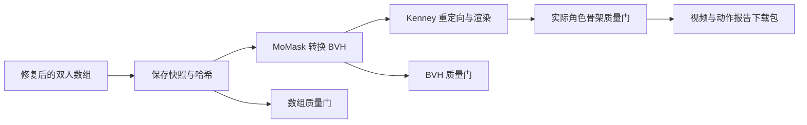

# MotionLint 修复动作的角色导出验证

本文保留早期导出验证；后续连续转换、角色脚部约束及当前规则版本 3 的结果见 [最新实现与交接](MOTIONLINT_DELIVERY_20261002.md)。

_2026-10-02 · 对应原方案的“修复后动作导出角色视频，并再次检测”任务。_

后续转换优化已完成两条样例的重新导出，最新自动比较流程和分数见 [转换与角色质量优化](MOTIONLINT_CONVERSION_OPTIMIZATION_20261002.md)。本页保留首次导出的基线记录。

---

## 📋 本轮结论

修复后的 InterGen 双人 NPY 现在可以转换成 BVH、重定向为 Kenney 双人角色、渲染完整视频，再读取实际 Blender 角色骨架进行六项复检。双人舞蹈和握手两个已有开发样例均完成了全流程。它们的最终角色质量门均为 **FAIL**，本轮完成的是导出与复检功能；严格质量门的阈值保持原样。

本轮不新增独立验证样本，也不改变此前 10 条验证样本的 0/10 PASS 结论。原方案中的问题时间轴、设置页、碰撞细项、四组系统实验和最终比赛材料仍需完成。

## ⚙️ 导出流程



新增实现：

- `motionlint/export_intergen.py`：调用已有 MoMask 转换器和 Blender/Rokoko 渲染器
- `motionlint/api.py`：异步导出、状态查询、视频播放和 ZIP 下载
- `project/src/App.vue`：导出入口、三阶段结果摘要、修复后 BVH/角色阶段选择
- `scripts/export_blender_motionlint.py`：记录场景输入阶段及 BVH 来源
- `scripts/verify_motionlint_export.py`：检查输入哈希、独立评分、ZIP 完整性和视频完整解码

导出时复制修复数组和当前质量配置，记录 SHA-256，输出保存在任务的 `motionlint/exports/<run-id>/`，原始导出保留。转换时关闭原生成导出器额外的关节平滑、手头碰撞修正和脚部位置清理，使用已经保存的修复数组作为输入。角色渲染仍采用现有重定向平滑、角色间距和角色脚部约束，因此其骨架单独复检。

公开 MoMask 转换器自带的旋转质量指标不完整，转换报告中的 `quality_gate_enabled: false` 指它自身的转换门。本轮仍对实际 BVH 运行完整 MotionLint 检测，并保存真实的 PASS/FAIL。

## 📊 两条实际样例

每条均为 180 帧、30 FPS、6 秒、540×540；未截断为预览片段。

| 样例 | 修复数组 | 修复后 BVH | 修复后角色 |
| --- | ---: | ---: | ---: |
| 双人舞蹈 `91d1b363` | 97.59 / PASS | 86.68 / FAIL | 83.61 / FAIL |
| 握手 `9323c3fd` | 94.03 / FAIL | 90.05 / FAIL | 84.55 / FAIL |

双人舞蹈的 BVH 仍有旋转连续性、脚滑和骨架距离问题；角色仍有旋转连续性、脚滑和地面接触问题。握手的 BVH 仍有旋转连续性与脚滑问题；角色仍有旋转连续性、脚滑和地面接触问题。

分数下降发生在转换或重定向后的独立检测阶段，具体原因仍需结合固定模板骨长、逐帧 IK 和角色约束继续诊断。这两个开发样例不能支持“最终角色已经通过严格门”或“修复普遍有效”的结论。此前保存的原始角色视频也采用不同的导出前处理，不能用这两次导出当作控制变量一致的修复消融实验。

机器记录：`reports/repaired_export_20261002/verification.json`。每次导出的目录包含三阶段质量报告、质量门、转换报告、渲染日志、实际角色骨架与场景输入清单。

## 📍 网页和终端用法

打开 `http://127.0.0.1:5173/`，点击 MotionLint，选择已有 InterGen 任务并加载。先执行 `Repair All` 保存数组，再点击“导出修复角色”。完成后可以点击“播放并检查修复角色”，或下载动作、BVH、视频与报告。选择“修复后导出的 BVH”会隐藏角色视频，避免将不同阶段混用。

独立终端入口使用 InterGen 环境，不加载 InterGen 生成模型：

```powershell
$exportPython = '..\HumanAction-runtime\envs\intergen\Scripts\python.exe'
& $exportPython -m motionlint.export_intergen `
  --task InterGen_api\task_runs\91d1b363-c453-4526-8bb2-8f933f25809b --size 540
```

InterGen 环境新增固定依赖 `upc-pymotion==0.3.4`，已安装并写入 `InterGen_api/requirements.txt`。

| 接口 | 用途 |
| --- | --- |
| `POST /v1/motionlint/export-character` | 导出已有修复数组；请求 `source`、`task_id`，可选 `size` |
| `GET .../character-export-status` | 查看排队、执行、失败、完成或过期状态 |
| `POST /v1/motionlint/inspect-stage` | 新增 `repaired_bvh` 和 `repaired_character` |
| `GET .../stage-video/repaired_character` | 播放对应修复角色视频 |
| `GET .../character-export-download` | 下载 ZIP |

导出只支持 InterGen 双人动作；LODGE 已有的修复 SMPL-X 视频链路继续使用原入口。无保存的修复数组时明确要求先修复。导出进程退出后不无限显示执行中；导出期间阻止重写输入。再次修复使输入哈希变化时，旧视频和下载会被拒绝，需重新导出。

下载包包括 NPY、BVH、MP4、实际角色骨架 NPZ、JSON/CSV 报告和冻结的 YAML 配置。FBX、`.blend` 和权重保留在本机。报告中的本机来源路径用于审计；视频和 BVH 可独立使用，报告路径不代表另一台机器已配置好渲染环境。

## ✅ 验证记录

- 15 项导出、阶段和 API 测试通过，覆盖输入变化、阶段防错配、缺失输入、路径边界、导出期间禁止重写、异常进程退出、下载资产排除及 FAIL 保留
- 前端生产构建通过；已有角色选择回归脚本通过
- 两条视频完整 FFmpeg 解码通过，两个 ZIP 完整性检查通过
- API 返回与落盘的 BVH/角色分数及质量门一致
- 浏览器完成历史任务加载、角色阶段选择及完整播放：舞蹈角色视频 `duration=6`、`readyState=4`，播放结束 `currentTime=6`、`ended=true`，页面显示 83.6 / FAIL
- 最新页面截图保存于 `output/playwright/repaired-export-20261002.png`；MotionLint API 重启后仍能读取已完成导出及独立质量门
- 浏览器仅出现已有的 favicon 404，未发现本轮新增脚本错误

## ✍️ 后续任务

1. 定位 NPY→BVH 的几何误差和旋转跳变，优先减少转换阶段的质量损失
2. 复核脚部接触并提高最终角色的脚滑、地面接触质量
3. 补齐网页问题时间轴、设置页及修复数量展示
4. 完成检测细项、四组系统实验、完整候选排序演示及最终材料

完整比赛验收、公开版本发布和基线 Git 提交尚未完成。
