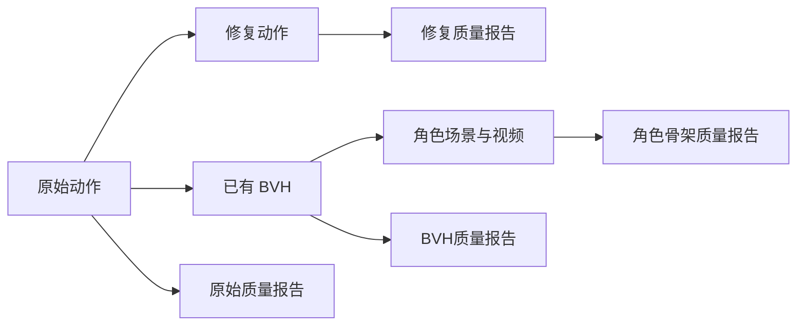

# MotionLint 新样例与最终展示阶段验证

日期：2026-09-30。对应用户选择的四项工作：画面检查、新样例、最终阶段检测、握手与挥手优化。

## 当前结论

本地动作生成、检查和修复流程可运行。新增 10 条独立动作全部生成成功，冻结的版本 2 修复使平均总分从 **91.42 提高至 94.13**，但严格质量门仍为 **0/10 PASS**。原有五条开发动作仍为 **3/5 PASS**。新样例没有支持“修复能普遍通过严格门”的结论。

页面现在可以选择原始动作、修复动作、导出 BVH、视频角色骨架四个阶段。报告与播放视频使用相同阶段；缺少对应视频时不沿用其他阶段的视频。BVH 和角色骨架暂不支持 Repair All。

| 用户选择的任务 | 已完成工作 | 尚未解决的问题 |
|---|---|---|
| 1. 画面检查 | 五条开发动作各抽取六个关键帧；核对姿态；记录接触变化区间 | 没有人工接触真值，二维骨架图不能证明三维支撑或无穿模 |
| 2. 新样例 | 8 条双人动作与 2 条原创节奏输入，生成、去重、冻结修复与测量 | 10 条新样例修复后仍有脚滑；其中两条还存在骨架距离风险 |
| 3. 最终 BVH/角色检查 | 修复 BVH 根节点误报；补齐脚部、单位、双人检测；读取 Blender 实际评估骨架；接入网页 | 现有导出与角色场景仍有脚滑、旋转跳变或地面接触问题 |
| 4. 握手/挥手优化 | 尝试有移动上限的慢速锚点与膝盖弯曲平面平滑，记录回归 | 没有优于现有结果且满足全部回归约束的候选；保留现有修复与 FAIL |

## 1. 画面与接触检查

结果位于 `reports/visual_review_20260930/`。`audit.json` 记录视频路径、采样帧、接触变化与风险区间；五张 `*_frames.png` 为前后对照。

抽查的 SMPL-X 帧中没有发现明显的整体翻转或肢体爆炸。aic260929 在 23.97 秒及 24.13 秒的手部靠近头部动作仍然保留；063 的腿部动作及 14.90 秒的抬脚仍保留。这只是选定静止帧的观察，不能证明整段连续、足底贴地或没有体表交叉。

InterGen 骨架预览采用固定 X/Y 投影，两个人物经常重叠，无法判断深度方向距离。接触标签仍需结合三维视角或人工标注核对。

| 开发动作 | 原始支撑区间数 | 最终重新估计支撑区间数 | 原支撑被排除且仍有水平滑动的区间数 |
|---|---:|---:|---:|
| 双人舞蹈 | 434 | 369 | 70 |
| 握手 | 625 | 545 | 59 |
| 挥手 | 623 | 525 | 84 |

区间数汇总人物与脚关节，不等于视频帧数。高度、垂直速度和脚跟/足尖切换都可能改变标签。本次没有把这些区间标记为“人工确认的摆动脚”，也没有用水平速度删除接触。双人舞蹈的 PASS 仍依赖修复后重新估计的接触；强制使用最初原始支撑时仍有 70 次滑动。

## 2. 冻结参数的新样例

8 个双人动作使用不同英文提示与随机种子 `26093000` 至 `26093007`，每条 180 帧、30 FPS、Best-of-1、关闭提示规划。两条 LODGE 使用本地合成的 96/132 BPM 打击乐测试输入，均为 36 秒，不是现成音乐录音。

文件哈希确认十条动作没有重复。这是不同输入的十次生成，不能视为公开基准的独立同分布抽样。没有因质量 FAIL 删除样例。

| 样例 | 原始分数 | 修复后分数 | 严格门 | 剩余阻断 |
|---|---:|---:|---|---|
| 握手 | 95.32 | 95.47 | FAIL | 脚滑 |
| 挥手 | 86.45 | 92.22 | FAIL | 脚滑、距离风险 |
| 并排走路 | 92.66 | 93.46 | FAIL | 脚滑 |
| 小步双人舞蹈 | 86.55 | 91.98 | FAIL | 脚滑、距离风险 |
| 击掌 | 91.42 | 95.26 | FAIL | 脚滑 |
| 鞠躬 | 92.19 | 95.44 | FAIL | 脚滑 |
| 指向左侧 | 94.35 | 96.35 | FAIL | 脚滑 |
| 向右侧步再返回 | 93.97 | 94.29 | FAIL | 脚滑 |
| 96 BPM 节奏 | 90.38 | 93.27 | FAIL | 脚滑 |
| 132 BPM 节奏 | 90.89 | 93.54 | FAIL | 脚滑 |

LODGE 第一次尝试分别遇到编号下划线导致合并失败、内存分配失败。失败任务与请求保存在 `generation.json` 的 `failed_attempts`。保持音频不变，改用不含下划线的编号后重试，均成功。这两次运行错误保留，不计为质量通过。

### 可复查文件

- `reports/validation_20260930/generation.json`：请求、种子、任务 ID、音频来源、失败重试、代码哈希。
- `reports/validation_20260930/frozen_code/motionlint/`：实际使用的版本 2 源码与配置副本。
- `reports/validation_20260930/motions.json`：十条输入路径。
- `reports/validation_20260930/measurements/`：完整前后报告、修复步骤与修复数组。
- `reports/validation_20260930/summary.json` 与 `summary.csv`：汇总。

`scripts/measure_motionlint_validation.py` 优先加载并核验冻结源码副本。后续开发修改不会改变本批次的测量算法。已重新运行确认结果可复现。不要把本批次作为新调参集后再宣称是独立验证。

## 3. 检查最终展示阶段

此前 PyMotion 根节点父节点为自身索引 `0`，与 MotionLint 的根节点约定 `-1` 不一致，误报根节点塌缩。BVH 适配器现把检测元数据中的根父节点改为 `-1`，保留 PyMotion FK 语义。没有降低骨架测试阈值。

适配器增加脚跟/足尖映射、显式单位倍率、垂直轴与同步双人读取。默认单位按本仓库导出器的米处理；外部厘米 BVH 需指定 `--unit-scale 0.01`。双人必须匹配帧数、FPS 和关节层级。

角色检查读取保存的 Blender 场景：每帧取得评估后角色骨骼的世界坐标起点，包含对象缩放、角色间距和场景动画。Blender Z-up 转为检测 Y-up，并记录场景到米的比例。读取过程不重新保存场景。导出保留 `.blend` 哈希，场景变化后拒绝使用旧骨架导出。

| 现有展示产物 | 总分 | 脚滑区间数 | 严格门 | 主要剩余问题 |
|---|---:|---:|---|---|
| 双人舞蹈 BVH | 84.05 | 251 | FAIL | 旋转跳变、脚滑、距离风险 |
| 双人舞蹈角色骨架 | 84.15 | 151 | FAIL | 旋转跳变、脚滑、地面接触 |
| 握手 BVH | 87.53 | 131 | FAIL | 旋转跳变、脚滑、地面接触 |
| 握手角色骨架 | 83.29 | 142 | FAIL | 旋转跳变、脚滑、地面接触 |
| LODGE aic260929 BVH | 93.14 | 259 | FAIL | 脚滑 |
| LODGE 063 BVH | 91.12 | 653 | FAIL | 脚滑 |

这些是之前保存的导出与角色视频场景，**没有重新用本轮修复 NPY 生成角色视频**。四个阶段的 PASS 数不能互相替代。骨架距离检查也不等于体表三角形碰撞。结果及来源见 `reports/final_stage_20260930/`。



### 网页与接口

进入 `http://127.0.0.1:5173/`，点击 MotionLint，选历史任务，点击“加载并检查”，再选择检查阶段。BVH 没有同阶段独立视频，选择它会隐藏主视频；角色骨架阶段播放对应角色视频。修复视频仍在排队时不沿用旧视频。

`POST /v1/motionlint/inspect-stage` 参数示例：

```json
{"source":"intergen","task_id":"91d1b363-c453-4526-8bb2-8f933f25809b","stage":"character"}
```

`stage` 支持 `raw`、`repaired`、`bvh`、`character`。没有产物时明确返回不可检查原因。

## 4. 握手与挥手的开发候选

保持脚部最大水平修正 15 cm、质量门及单项回归 5 分预算不变。慢速锚点允许原接触期间缓慢移动，通过有界投影减少水平速度；长距离漂移与移动上限矛盾时不能保证满足速度约束，因此必须复测。

每条动作比较八个有限候选，包括不同时间平滑、修正强度，以及 3 cm 上限的膝盖弯曲平面平滑。最激进候选把握手脚滑次数从现有 72 降为 51、挥手从 83 降为 62，但抖动项分别比脚部修复输入下降 6.77、7.56 分，超过 5 分预算，总分也低于现有修复。因此拒绝采用。其余候选未优于现有修复。

该方法仅作为开发候选供直接实验，未加入 Repair All 的候选集合。实验见 `scripts/optimize_motionlint_support_path.py` 与 `reports/support_path_20260930/summary.json`。握手与挥手仍为 FAIL；原有五条开发动作的数组与评分复测一致。

在保持原始支撑区间的假设下，握手最差段至少需要约 30.06 cm、挥手约 26.94 cm 的端点移动，超过当前上限。这只是必要条件分析，不证明接触标签真实，也不证明完整 IK 可行。

## 验证与后续重点

- 46 项 MotionLint 测试通过，包括 BVH 根节点、单位、双人时间对齐、阶段视频防错配、锚点移动上限。
- 前端生产构建通过。
- 旧样例输入哈希、质量门、原始评分、保存修复评分保持一致。
- 冻结源码重新测量新样例，结果一致。
- 角色阶段真实 API 返回 84.15、FAIL，并指向对应角色视频。
- 浏览器验证原始、BVH、角色阶段切换：角色视频成功加载（readyState 4）；BVH 阶段视频数为 0，并禁用 Repair All。控制台只有原有 favicon 404，没有新增脚本错误。

下一步应优先建立可靠接触标注，并把修复写回 BVH/角色后再次检测。现在可以展示能运行、能诊断、能拒绝有害修复的近似复现系统；不能宣称全部动作通过质量门或最终角色视频已修复完成。
